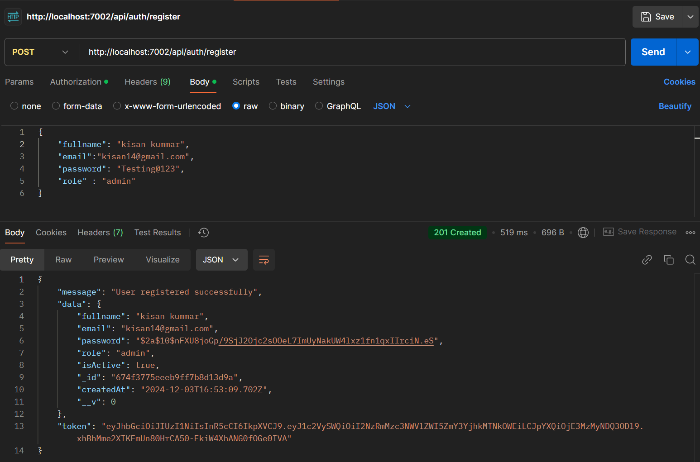
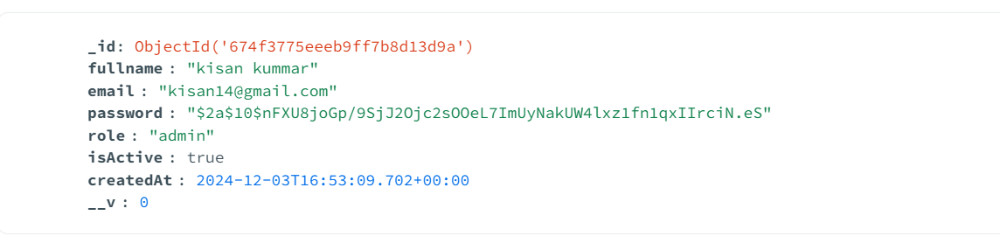
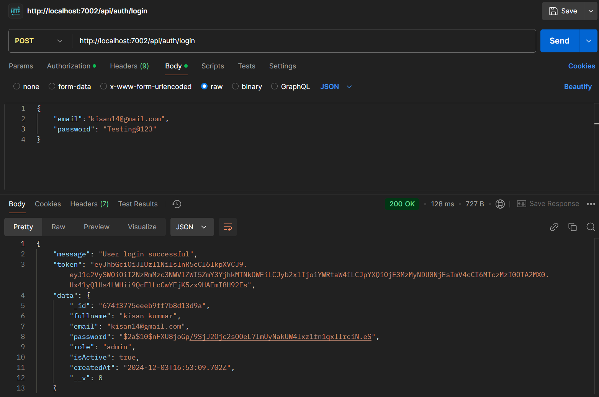
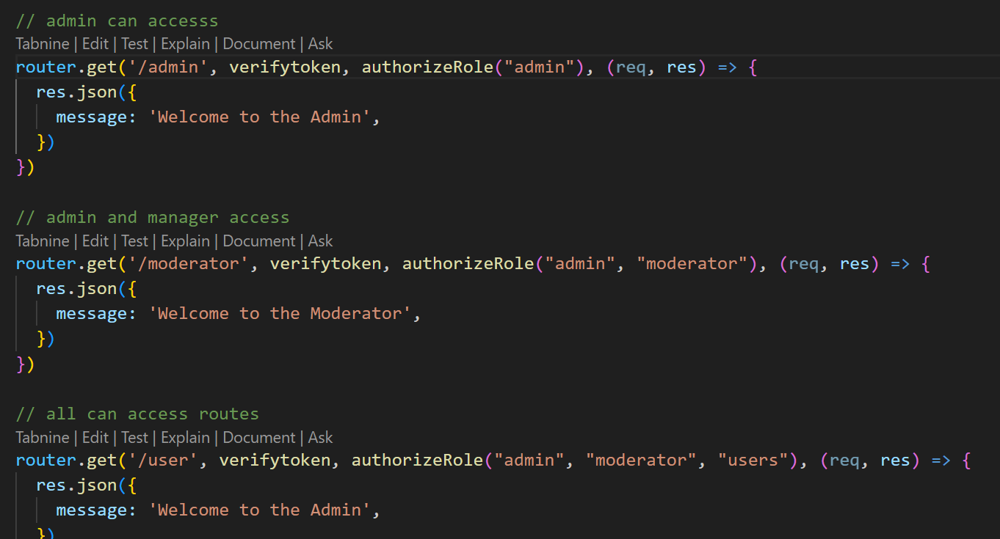

# Role-Based-Authentication-System
Authenticating the user using Role-Based Access Control(RBAC) and hashing the password before it is stored in the database.
Can be able to register, login, and reset of passwords with validation of input.

## Tech Stack used
- JavaScript
- NodeJs
- Express Js 
- Jsonwebtoken
- Bcrypt
- MongoDB
- zod
- Docker

## Steps to execute
1. Clone the repository
2. Install the required packages by running `npm install` in the terminal
3. Create a .env file and put the `PORT`, `JWT_SERECT`, and `CONNECTION_STRING`
4. Create a new MongoDB database or use docker to create a Mongo image and replace the `CONNECTION_STRING`
5. Run the application by executing `node index.js` in the terminal or run `npm run dev`
6. Run the role-based authentication using the barear token get after login or registration to access the particular role.

## Execution
- Register the user with the JWT sign and hash password

- Database saved in MongoDB

- Error registrations
  

- Login user

- Role Access code -> use token to authenticate the user

