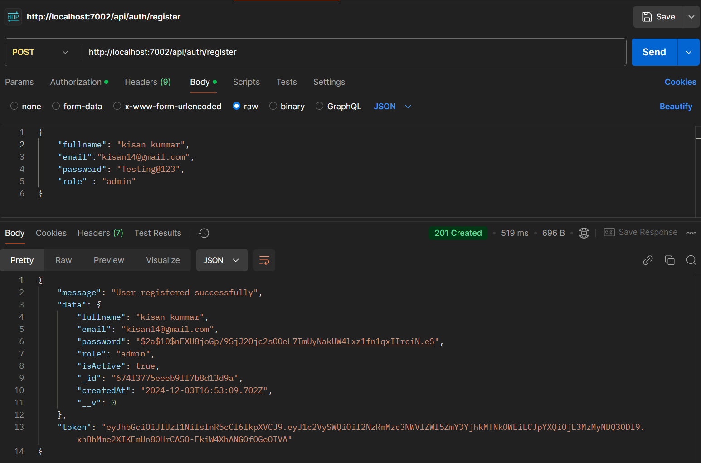

# Role-Based-Authentication-System
Authentication the user using the Role-Based Access Control(RBAC). And hashing the password before it store to the database.
Can be able to registration, login, and reset of password with validation of input.

## Tech Stack used
- JavaScript
- NodeJs
- Express Js 
- Jsonwebtoken
- Bcrypt
- MongoDB
- zod
- Docker

## Steps to execute
1. Clone the repository
2. Install the required packages by running `npm install` in the terminal
3. Create a .env file and put the `PORT`, `JWT_SERECT` and `CONNECTION_STRING`
4. Create a new MongoDB database and replace the `MONGO_URI` or use docker to create a Mongo image
5. Run the application by executing `node index.js` in the terminal or run `npm run dev`

## Execution
- Register the user with the JWT sign and hash password

- Database saved in MongoDB

- Error regitrstions
  

- Login user

- Role Access code -> use token to authenticate the user
